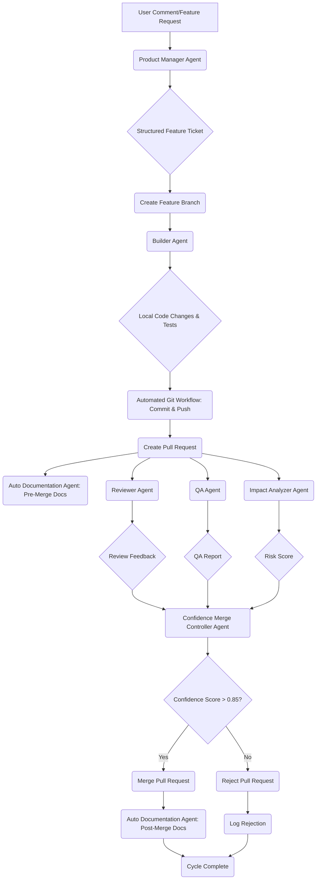
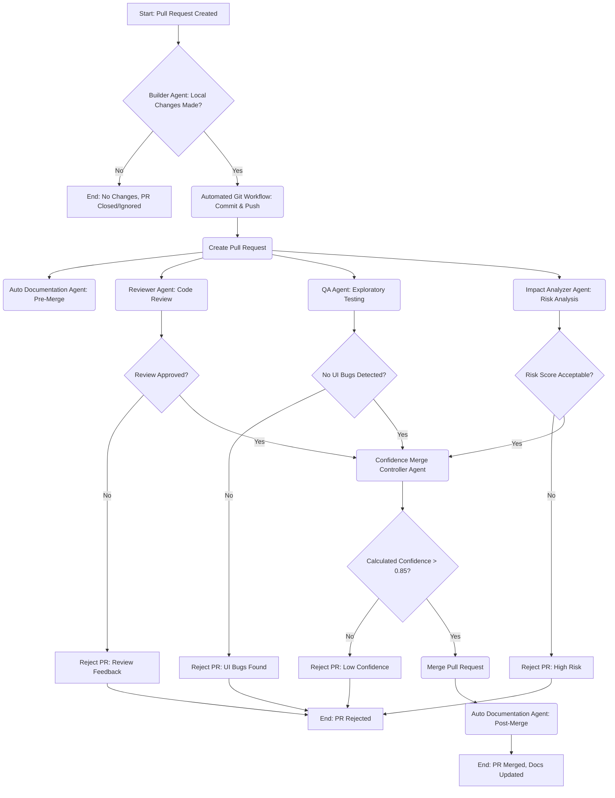

# Autonomous DevOps Agents

This directory contains a suite of AI-powered agents designed to automate various stages of the software development lifecycle, from feature ideation to deployment and documentation. Each agent specializes in a specific role, collaborating to streamline development workflows and ensure high-quality software delivery.

## Agents Overview

Here's a brief description of each agent:

### 1. Product Manager Agent (`product_manager_agent.py`)
*   **Role**: Transforms raw user comments or feature requests into structured feature tickets (JSON format) for development.
*   **Key Responsibilities**: Feature ID generation, title and description creation, priority assignment, and defining acceptance criteria.

### 2. Builder Agent (`builder_agent.py`)
*   **Role**: Implements new features and develops corresponding automated tests.
*   **Key Responsibilities**: Code generation for features, creation of Selenium test files, local file writing, test execution, and self-debugging.

### 3. Reviewer Agent (`reviewer_agent.py`)
*   **Role**: Conducts comprehensive code reviews on Pull Requests.
*   **Key Responsibilities**: Assessing code quality, style adherence, complexity, logical correctness, identifying bugs, and providing structured suggestions.

### 4. QA Agent (`qa_agent.py`)
*   **Role**: Performs exploratory testing on temporary deployments of new features.
*   **Key Responsibilities**: Deploying projects to platforms like Vercel or Docker, executing UI interaction tests using Selenium, capturing visual and log evidence, and reporting UI bugs.

### 5. Impact Analyzer Agent (`impact_analyzer_agent.py`)
*   **Role**: Analyzes code changes (commit diffs) to predict feature stability and assign a risk score.
*   **Key Responsibilities**: Evaluating potential impact of changes, identifying areas of high risk, and logging analysis results.

### 6. Confidence Merge Controller Agent (`confidence_merge_controller_agent.py`)
*   **Role**: Gathers data from other agents to calculate a confidence score for a Pull Request and decides on automatic merging.
*   **Key Responsibilities**: Aggregating test results, review feedback, QA reports, and risk scores; calculating a merge confidence level; and executing merge operations or logging rejections.

### 7. Auto Documentation Agent (`auto_documentation_agent.py`)
*   **Role**: Automatically updates project documentation based on merged Pull Requests.
*   **Key Responsibilities**: Analyzing commit diffs to update `README.md`, `CHANGELOG.md`, and `CODECONTEXT.md` with relevant changes and summaries.

## Workflow Operation

The autonomous DevOps cycle is orchestrated by the `orchestrator.py` script, which coordinates the activities of all agents. The process begins with a raw user comment and proceeds through several stages, involving various agents and Git operations.

### High-Level Workflow:

1.  **Feature Request Ingestion**: A raw user comment describing a feature is fed into the system.
2.  **Feature Ticket Creation**: The **Product Manager Agent** processes the comment and generates a structured feature ticket.
3.  **Branching & Development**: A new feature branch is created, and the **Builder Agent** implements the feature and writes tests locally.
4.  **Code Submission**: Local changes are committed and pushed to the feature branch, and a Pull Request (PR) is created.
5.  **Pre-Merge Documentation**: The **Auto Documentation Agent** performs an initial documentation update based on the PR.
6.  **Code Review**: The **Reviewer Agent** analyzes the PR for code quality, style, and correctness.
7.  **Quality Assurance**: The **QA Agent** deploys a temporary environment and performs exploratory UI testing.
8.  **Impact Analysis**: The **Impact Analyzer Agent** assesses the risk associated with the changes in the PR.
9.  **Merge Decision**: The **Confidence Merge Controller Agent** aggregates results from all previous agents, calculates a confidence score, and decides whether to automatically merge the PR.
10. **Post-Merge Documentation**: If merged, the **Auto Documentation Agent** performs a final documentation update.

### Detailed Workflow and Agent Interactions:



### Decision Tree for Pull Request Merging:



### Current Status and Future Work

**What's Already Done:**

*   **Agent Architecture**: All seven core agents (`Product Manager`, `Builder`, `Reviewer`, `QA`, `Impact Analyzer`, `Confidence Merge Controller`, `Auto Documentation`) are defined with their respective responsibilities and tool interactions.
*   **Orchestration Logic**: The `orchestrator.py` script provides the sequential flow for the DevOps cycle, calling each agent in order.
*   **Git Integration**: Basic Git operations (clone, branch, checkout, add, commit, push, create PR, merge PR) are implemented via `git_workflow.py` and `GithubAPI`.
*   **Tooling Integration**: Agents are integrated with external tools like `GithubAPI`, `MongoDBService`, `SeleniumTester`, `RiskAnalyzer`, and `CIManager` (though some are placeholders).
*   **Logging**: MongoDB integration for logging agent activities and decisions is in place.
*   **LLM Interaction**: Agents are designed to interact with large language models (Gemini-2.5-flash) for their core reasoning and content generation tasks.

**What Still Needs to be Worked Upon (Future Enhancements):**

*   **Robust Error Handling & Retry Mechanisms**: While some retry logic is present, a more comprehensive error handling strategy across all agents and the orchestrator is needed, especially for external API calls and tool executions.
*   **Dynamic Tool Parameterization**: Currently, some tool parameters are hardcoded or simplified (e.g., `project_path` for QA Agent). This needs to be made more dynamic, potentially by passing outputs between agents.
*   **Advanced Test Generation & Execution**: The `Builder Agent`'s test generation can be enhanced to cover more complex scenarios. `SeleniumTester` needs to be fully implemented with actual UI interaction logic and robust test reporting.
*   **Real-time Feedback Loop**: Implementing a mechanism for agents to provide real-time feedback to each other or to a central dashboard for better visibility and faster iteration.
*   **Context Management**: Enhancing how agents maintain and share context (e.g., `repo_vector_memory` in Impact Analyzer) across the entire DevOps cycle.
*   **Human-in-the-Loop**: Introducing optional human intervention points for critical decisions (e.g., manual review before merge for high-risk changes).
*   **Scalability & Performance**: Optimizing agent execution for larger repositories and more complex features.
*   **Security**: Implementing security best practices for API keys, access tokens, and deployment environments.
*   **Comprehensive Reporting**: Developing more detailed and customizable reports for each stage of the DevOps cycle.
*   **Deployment Flexibility**: Expanding `CIManager` to support a wider range of deployment targets and configurations.
*   **Refined Confidence Calculation**: The `Confidence Merge Controller Agent`'s confidence formula can be refined with more nuanced inputs and weights.

## Getting Started

To set up and run these agents, you would typically:

1.  **Clone the Repository**: Ensure you have the project cloned locally.
2.  **Environment Variables**: Set up your `GEMINI_API_KEY` and GitHub token in a `.env` file.
3.  **Dependencies**: Install all necessary Python dependencies (e.g., `google-generativeai`, `python-dotenv`, `PyGithub`, `pymongo`, `selenium`, `tenacity`).
4.  **MongoDB**: Ensure a MongoDB instance is accessible for logging.
5.  **Execution**: Run the `orchestrator.py` script, providing a raw user comment as input.

```bash
# Example of running the orchestrator
python autonomous_devops/orchestrator.py
```
(Follow the prompts to enter your feature request.)
